2020.11.24 201809058  Wang Yulong
<font face = 楷体 >

# OpenCV的安装、Visual Studio的安装与配置测试

----

1.安装Visual Studio 2019 Community


<center>图1 下载Community版的Visual Studio</center>

2.安装 openCV ，在下方网址选择opencv-4.5.0版本
https://www.bzblog.online/wordpress/index.php/2020/03/09/opencvdownload/


<center>图2 opencv的版本</center>


3.配置opencv的环境变量
步骤：我的电脑-->右键属性-->高级系统设置-->高级-->环境变量-->系统变量Path-->添加opencv的dll文件的安装路径


<center>图3 系统环境变量Path</center>

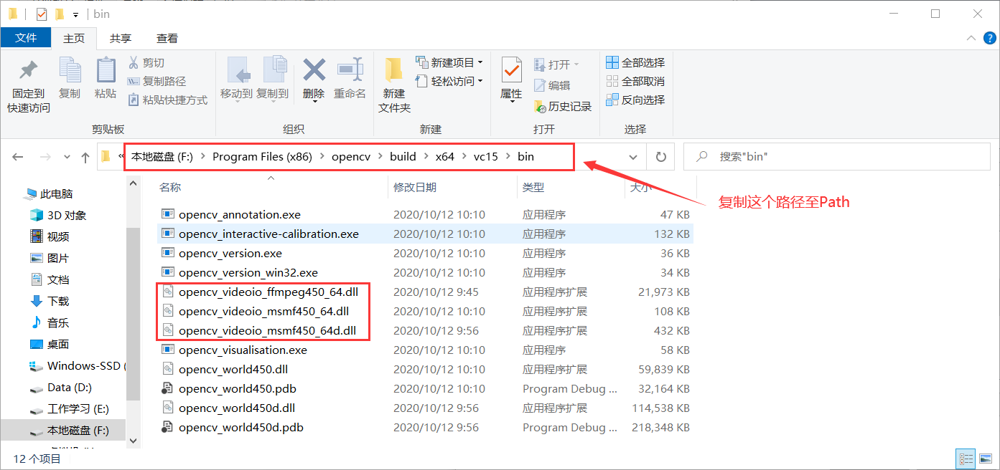
<center>图4 opencv的dll文件路径</center>


<center>图5 添加dll路径至Path</center>

4.在Visual Studio 2019 Community中创建工程

①打开软件后，创建新项目
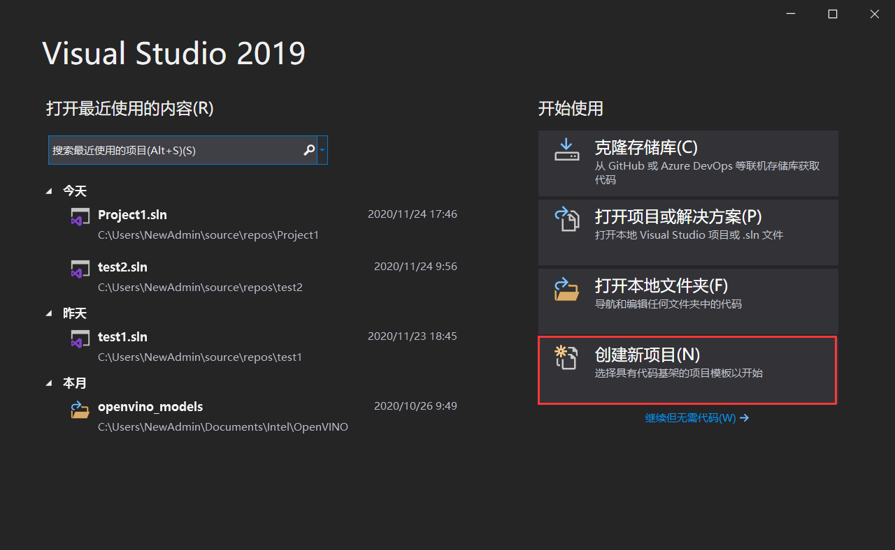
<center>图6  创建项目</center>

②选择Windows桌面应用程序

<center>图7 选择工程类型</center>

③自动生成工程名，并创建
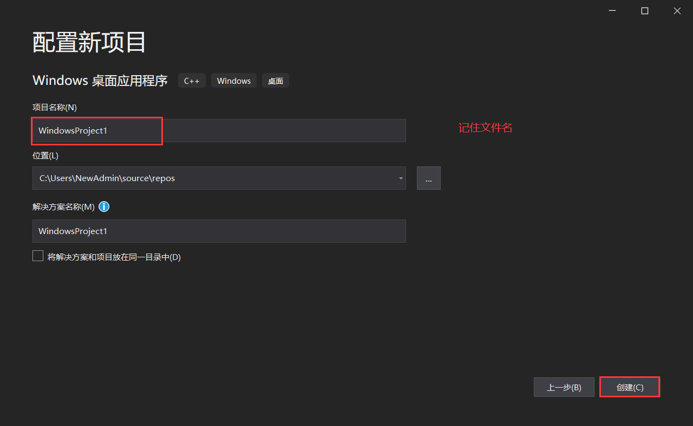

<center>图8 创建工程 </center>


④选择 Debug x64 ，一定要选对，否则会影响后续实验

<center>图9 选择Visual Studio平台的调试器</center>

⑤选择C++源文件

<center>图10 添加C++源文件</center>


⑥属性配置：视图-->其他窗口-->属性管理器


<center>图11 属性配置</center>

⑦添加包含目录和库目录的路径
包含目录：

******（磁盘路径）\opencv\build\include


******（磁盘路径）\opencv\build\include\opencv2


库目录：

******（磁盘路径）\opencv\build\x64\vc15\lib


<center>图12 包含目录与库目录配置</center>
⑧添加附加依赖项，将v15文件夹的lib文件名复制进去即可


<center>图13 附加依赖项</center>


<center>图14 lib文件名</center>

---

# <center>  5.测试 </center> 

## 5.1 ShowImg---imread()函数

```cpp

#include <iostream>
#include <opencv2/opencv.hpp>

using namespace cv;

int main()
{
    Mat img = imread("C:\\Users\\NewAdmin\\Pictures\\1.jpg");

	imshow("图片", img);

	waitKey(0);
    }
```


<center>图15 图片展示</center>

（1）imread函数用于读取文件中的图片到OpenCV中，其格式为：
```cpp
Mat imread（const string& filename, intflages=1);
```
（2） imshow函数用于在指定的窗口中显示一幅图像，其函数原型为：
```cpp
void imshow（const string& winname，InputArray mat）；
```
## 5.2 ErodeImg---erode()函数

```cpp
#include<iostream>
#include<opencv2/highgui/highgui.hpp>
#include<opencv2/imgproc/imgproc.hpp>

using namespace cv;

int main()
{
	Mat img = imread("C:\\Users\\NewAdmin\\Pictures\\1.jpg");

	imshow("图片 腐蚀操作", img);
	Mat element = getStructuringElement(MORPH_RECT, Size(10, 10));
	Mat dstImage;
	erode(img, dstImage, element);
	imshow("效果图 腐蚀操作",dstImage);

	waitKey(0);
}
```


<center>图16 图片腐蚀</center>

erode()函数可以对输入图像用特定结构元素进行腐蚀操作，该结构元素确定腐蚀操作过程中的邻域的形状，各点像素值将被替换为对应邻域上的最小值：
```cpp
erode（InputArray src，OutputArraydst，InputArray kernel，Point anchor，int iterations，int borderType，constScalar& borderValue)
```
（1）第一个参数，InputArray 类型的 src，输入图像，即源图像，填 Mat 类的对象即可。图像通道的数量可以是任意的，但图像深度应为 CV_8U，CV_16U，CV_16S，CV_32F 或 CV_64F 其中之一。

（2）第二个参数，OutputArray 类型的 dst，即目标图像，需要和源图片有一样的尺寸和类型。

（3）第三个参数，InputArray 类型的 kernel，腐蚀操作的内核。若为 NULL 时，表示的是使用参考点位于中心 3x3 的核。我们一般使用函数 getStructuringElement 配合这个参数的使用。getStructuringElement 函数会返回指定形状和尺寸的结构元素（内 核矩阵）。

（4）第四个参数，Point 类型的 anchor，锚的位置，其有默认值（-1，-1），表示锚位于单位（element）的中心，我们一般不用管它。

（5）第五个参数，int 类型的 iterations，迭代使用 erode（）函数的次数，默认值为 1。

（6）第六个参数，int 类型的 borderType，用于推断图像外部像素的某种边界模式。注意它有默认值 BORDER_DEFAULT。

（7）第七个参数，const Scalar&类型的 borderValue，当边界为常数时的边界值，有默值 morphologyDefaultBorderValue()。

## 5.3 BlurImg---blur()函数

```cpp
#include<iostream>
#include<opencv2/highgui/highgui.hpp>
#include<opencv2/imgproc/imgproc.hpp>

using namespace cv;

int main()
{   //载入原图
	Mat img = imread("C:\\Users\\NewAdmin\\Pictures\\1.jpg");
    //显示原图
	imshow("均值滤波 【原图】", img);
    //均值滤波操作
	Mat dstImage;
	
	blur(img, dstImage, Size(7,7));
    //显示效果图
	imshow("均值滤波【效果图】",dstImage);

	waitKey(0);
}
```
主要函数说明：
blur函数的作用是对输入的图像src进行均值滤波后用dst输出。格式为： void blur(InputArray src, OutputArraydst, Size ksize, Point anchor=Point(-1,-1), int borderType=BORDER_DEFAULT )；

（1）第一个参数，InputArray类型的src，输入图像，即源图像，填Mat类的对象即可。该函数对通道是独立处理的，且可以处理任意通道数的图片，但需要注意，待处理的图片深度应该为CV_8U, CV_16U, CV_16S, CV_32F 以及 CV_64F之一。

（2）第二个参数，OutputArray类型的dst，即目标图像，需要和源图片有一样的尺寸和类型。比如可以用Mat::Clone，以源图片为模板，来初始化得到如假包换的目标图。

（3）第三个参数，Size类型（对Size类型稍后有讲解）的ksize，内核的大小。一般这样写Size( w,h )来表示内核的大小( 其中，w 为像素宽度， h为像素高度)。Size（3,3）就表示3x3的核大小，Size（5,5）就表示5x5的核大小。

（4）第四个参数，Point类型的anchor，表示锚点（即被平滑的那个点），注意他有默认值Point(-1,-1)。如果这个点坐标是负值的话，就表示取核的中心为锚点，所以默认值Point(-1,-1)表示这个锚点在核的中心。

（5）第五个参数，int类型的borderType，用于推断图像外部像素的某种边界模式。有默认值BORDER_DEFAULT。


<center>图17 图片模糊</center>

## 5.4 CannyImg---Canny()函数
主要函数说明：
```cpp
void cvCanny( const CvArr* image, CvArr* edges, double threshold1, double threshold2, int aperture_size=3 );
```
（1）它的第一个参数表示输入图像，必须为单通道灰度图。

（2）第二个参数表示输出的边缘图像，为单通道黑白图。

（3）第三个参数和第四个参数表示阈值，这二个阈值中当中的小阈值用来控制边缘连接，大的阈值用来控制强边缘的初始分割即如果一个像素的梯度大与上限值，则被认为是边缘像素，如果小于下限阈值，则被抛弃。如果该点的梯度在两者之间则当这个点与高于上限值的像素点连接时我们才保留，否则删除。

（4）第五个参数表示Sobel 算子大小，默认为3即表示一个3*3的矩阵。 边缘检测的一般步骤

1）滤波：边缘检测的算法主要是基于图像强度的一阶和二阶导数，但导数通常对噪声很敏感，因此必须采用滤波器来改善与噪声有关的边缘检测器的性能。常见的滤波方法主要有高斯滤波，即采用离散化的高斯函数产生一组归一化的高斯核，然后基于高斯核函数对图像灰度矩阵的每一点进行加权求和。

2）增强：增强边缘的基础是确定图像各点邻域强度的变化值。增强算法可以将图像灰度点邻域强度值有显著变化的点凸显出来。在具体编程实现时，可通过计算梯度幅值来确定。

3）检测：经过增强的图像，往往邻域中有很多点的梯度值比较大，而在特定的应用中，这些点并不是我们要找的边缘点，所以应该采用某种方法来对这些点进行取舍。实际工程中，常用的方法是通过阈值化方法来检测。

```cpp
#include<iostream>
#include<opencv2/opencv.hpp>
#include<opencv2/imgproc/imgproc.hpp>

using namespace cv;

int main()
{      //【0】载入原始图
	Mat img = imread("C:\\Users\\NewAdmin\\Pictures\\1.jpg");

	imshow("Canny边缘检测 【原图】", img);
	Mat dstImage,edge,grayImage; //参数定义
	//【1】创建与img同类型和大小的矩阵(dst)
	dstImage.create(img.size(), img.type());
	//【2】将原图像转换为灰度图像
	cvtColor(img, grayImage, COLOR_BGR2GRAY);
	//【3】使用3×3内核降噪
	blur(grayImage, edge, Size(3, 3));
	//【4】运行Canny算子
	Canny(edge, edge, 3, 9, 3);
	//【5】显示效果图
	imshow("【效果图】Canny边缘检测", edge);
	waitKey(0);
	return 0;
}
```


<center>图18 图片边缘检测</center>

## 5.5 VideoCapture
在完成此实验前，要先放置一个名为“1.mp4”的视频在工程目录中
```cpp
#include<iostream>
#include<opencv2/opencv.hpp>
#include<opencv2/imgproc/imgproc.hpp>

using namespace cv;

int main()
{      //【0】读入视频
	VideoCapture capture("1.mp4");
	
	while (1)
	{
		Mat frame;  //定义一个Mat变量，存储每一帧的图像
		capture >> frame; //读取当前帧
		imshow("读取视频", frame); //显示当前帧
		waitKey(50);  //延时50ms
	}
	return 0;
}
```
在这段代码中，首先定义了一个Mat变量，用于存储每一帧的图像，接着读取当前帧到Mat变量中，然后调用imshow()函数显示当前这帧的图像，并用waitKey()延时50ms.

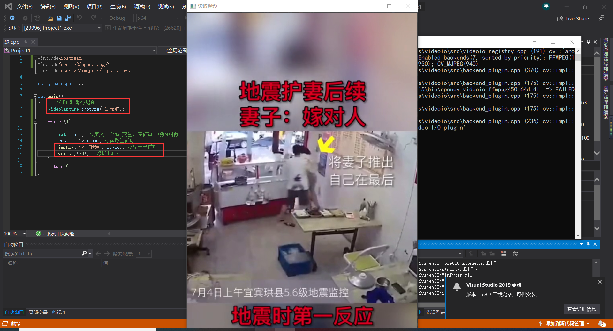
<center>图19 读取视频并播放</center>

边缘检测处理的视频：
```cpp
#include<iostream>
#include<opencv2/opencv.hpp>

using namespace cv;

int main()
{      //【0】从摄像头读入视频
	VideoCapture capture("1.mp4");
	Mat edges;
	while (1)
	{
		Mat frame;  //定义一个Mat变量，存储每一帧的图像
		capture >> frame; //读取当前帧
		cvtColor(frame, edges, COLOR_BGR2GRAY);//OpenCV3版本语句==>转换BGR彩色图为灰度图
		//【1】使用3×3内核降噪
		blur(edges, edges, Size(7, 7));//模糊处理
		//【2】Canny边缘检测并显示
		Canny(edges, edges, 0, 30, 3);
		imshow("边缘检测后的视频", edges); //显示当前帧
		waitKey(50);  //延时50ms
	}
	return 0;
}
```
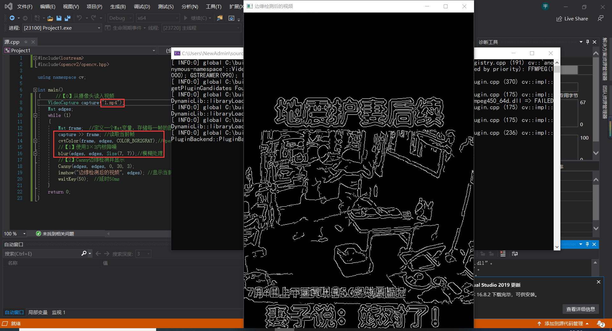
<center>图20 读取Canny视频并播放</center>
## 5.6 CameraCapture

```cpp
#include<iostream>
#include<opencv2/opencv.hpp>

using namespace cv;

int main()
{      //【0】从摄像头读入视频
	VideoCapture capture(0);
	
	while (1)
	{
		Mat frame;  //定义一个Mat变量，存储每一帧的图像
		capture >> frame; //读取当前帧
		imshow("读取视频", frame); //显示当前帧
		waitKey(50);  //延时50ms
	}
	return 0;
}
```
VideoCapture capture()的括号中，填0，为调用摄像头；填写同工程目录下的视频名，则可读取视频。

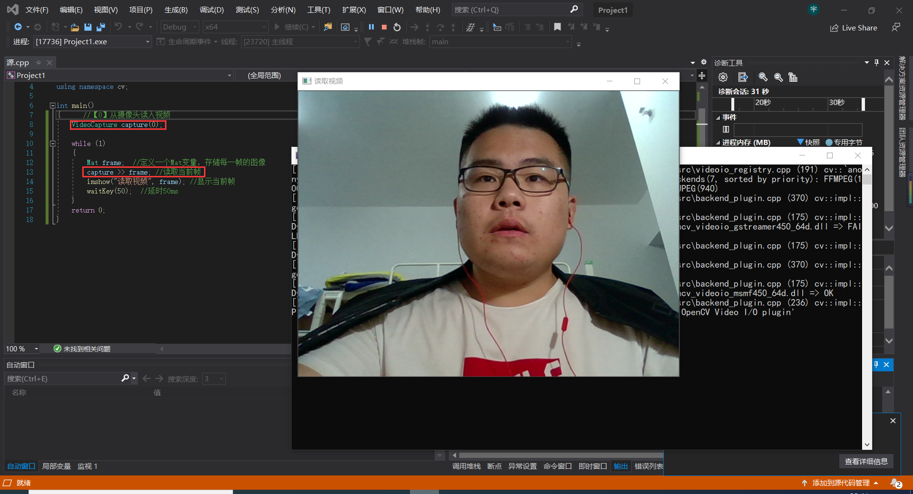
<center>图21 读取摄像头</center>

边缘检测时调用摄像头：
```cpp
#include<iostream>
#include<opencv2/opencv.hpp>

using namespace cv;

int main()
{      //【0】从摄像头读入视频
	VideoCapture capture(0);
	Mat edges;
	while (1)
	{
		Mat frame;  //定义一个Mat变量，存储每一帧的图像
		capture >> frame; //读取当前帧
		cvtColor(frame, edges, COLOR_BGR2GRAY);//OpenCV3版本语句==>转换BGR彩色图为灰度图
		//【1】使用3×3内核降噪
		blur(edges, edges, Size(7, 7));//模糊处理
		//【2】Canny边缘检测并显示
		Canny(edges, edges, 0, 30, 3);
		imshow("边缘检测后的视频", edges); //显示当前帧
		waitKey(50);  //延时50ms
	}
	return 0;
}
```

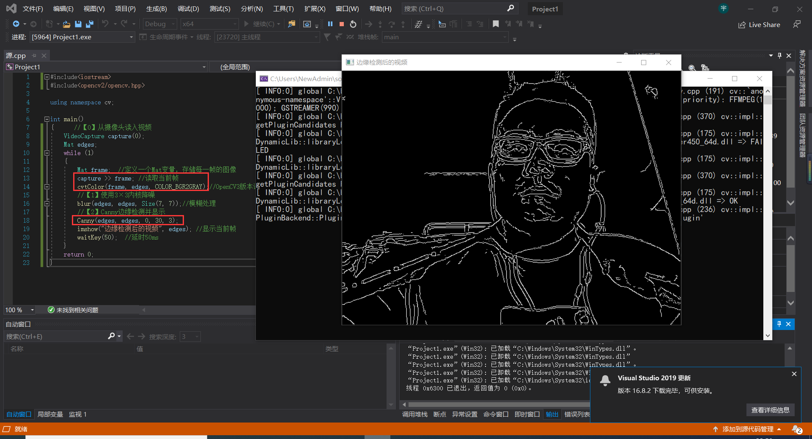
<center>图22 读取摄像头-Canny</center>

---
## <font color=orange> <center>  Summary   </center> </font>
---
以上内容：

- 1.安装Visual Studio 2019 Community
- 2.安装 openCV
- 3.配置opencv的环境变量
- 4.图片显示、图片腐蚀、blur图片模糊处理、canny边缘检测
- 5.读取视频并canny处理，调用摄像头并canny处理

---
# <center> Chapter2 </center>

## 2.1 彩色目标跟踪---Camshift

```cpp
#include "opencv2/core/utility.hpp"
#include "opencv2/video/tracking.hpp"
#include "opencv2/imgproc.hpp"
#include "opencv2/videoio.hpp"
#include "opencv2/highgui.hpp"

#include <iostream>
#include <ctype.h>

using namespace cv;
using namespace std;

Mat image;

bool backprojMode = false;
bool selectObject = false;
int trackObject = 0;
bool showHist = true;
Point origin;
Rect selection;
int vmin = 10, vmax = 256, smin = 30;

// User draws box around object to track. This triggers CAMShift to start tracking
static void onMouse(int event, int x, int y, int, void*)
{
    if (selectObject)
    {
        selection.x = MIN(x, origin.x);
        selection.y = MIN(y, origin.y);
        selection.width = std::abs(x - origin.x);
        selection.height = std::abs(y - origin.y);

        selection &= Rect(0, 0, image.cols, image.rows);
    }

    switch (event)
    {
    case EVENT_LBUTTONDOWN:
        origin = Point(x, y);
        selection = Rect(x, y, 0, 0);
        selectObject = true;
        break;
    case EVENT_LBUTTONUP:
        selectObject = false;
        if (selection.width > 0 && selection.height > 0)
            trackObject = -1;   // Set up CAMShift properties in main() loop
        break;
    }
}

string hot_keys =
"\n\nHot keys: \n"
"\tESC - quit the program\n"
"\tc - stop the tracking\n"
"\tb - switch to/from backprojection view\n"
"\th - show/hide object histogram\n"
"\tp - pause video\n"
"To initialize tracking, select the object with mouse\n";

static void help(const char** argv)
{
    cout << "\nThis is a demo that shows mean-shift based tracking\n"
        "You select a color objects such as your face and it tracks it.\n"
        "This reads from video camera (0 by default, or the camera number the user enters\n"
        "Usage: \n\t";
    cout << argv[0] << " [camera number]\n";
    cout << hot_keys;
}

const char* keys =
{
    "{help h | | show help message}{@camera_number| 0 | camera number}"
};

int main(int argc, const char** argv)
{
    VideoCapture cap;
    Rect trackWindow;
    int hsize = 16;
    float hranges[] = { 0,180 };
    const float* phranges = hranges;
    CommandLineParser parser(argc, argv, keys);
    if (parser.has("help"))
    {
        help(argv);
        return 0;
    }
    int camNum = parser.get<int>(0);
    cap.open(camNum);

    if (!cap.isOpened())
    {
        help(argv);
        cout << "***Could not initialize capturing...***\n";
        cout << "Current parameter's value: \n";
        parser.printMessage();
        return -1;
    }
    cout << hot_keys;
    namedWindow("Histogram", 0);
    namedWindow("CamShift Demo", 0);
    setMouseCallback("CamShift Demo", onMouse, 0);
    createTrackbar("Vmin", "CamShift Demo", &vmin, 256, 0);
    createTrackbar("Vmax", "CamShift Demo", &vmax, 256, 0);
    createTrackbar("Smin", "CamShift Demo", &smin, 256, 0);

    Mat frame, hsv, hue, mask, hist, histimg = Mat::zeros(200, 320, CV_8UC3), backproj;
    bool paused = false;

    for (;;)
    {
        if (!paused)
        {
            cap >> frame;
            if (frame.empty())
                break;
        }

        frame.copyTo(image);

        if (!paused)
        {
            cvtColor(image, hsv, COLOR_BGR2HSV);

            if (trackObject)
            {
                int _vmin = vmin, _vmax = vmax;

                inRange(hsv, Scalar(0, smin, MIN(_vmin, _vmax)),
                    Scalar(180, 256, MAX(_vmin, _vmax)), mask);
                int ch[] = { 0, 0 };
                hue.create(hsv.size(), hsv.depth());
                mixChannels(&hsv, 1, &hue, 1, ch, 1);

                if (trackObject < 0)
                {
                    // Object has been selected by user, set up CAMShift search properties once
                    Mat roi(hue, selection), maskroi(mask, selection);
                    calcHist(&roi, 1, 0, maskroi, hist, 1, &hsize, &phranges);
                    normalize(hist, hist, 0, 255, NORM_MINMAX);

                    trackWindow = selection;
                    trackObject = 1; // Don't set up again, unless user selects new ROI

                    histimg = Scalar::all(0);
                    int binW = histimg.cols / hsize;
                    Mat buf(1, hsize, CV_8UC3);
                    for (int i = 0; i < hsize; i++)
                        buf.at<Vec3b>(i) = Vec3b(saturate_cast<uchar>(i * 180. / hsize), 255, 255);
                    cvtColor(buf, buf, COLOR_HSV2BGR);

                    for (int i = 0; i < hsize; i++)
                    {
                        int val = saturate_cast<int>(hist.at<float>(i) * histimg.rows / 255);
                        rectangle(histimg, Point(i * binW, histimg.rows),
                            Point((i + 1) * binW, histimg.rows - val),
                            Scalar(buf.at<Vec3b>(i)), -1, 8);
                    }
                }

                // Perform CAMShift
                calcBackProject(&hue, 1, 0, hist, backproj, &phranges);
                backproj &= mask;
                RotatedRect trackBox = CamShift(backproj, trackWindow,
                    TermCriteria(TermCriteria::EPS | TermCriteria::COUNT, 10, 1));
                if (trackWindow.area() <= 1)
                {
                    int cols = backproj.cols, rows = backproj.rows, r = (MIN(cols, rows) + 5) / 6;
                    trackWindow = Rect(trackWindow.x - r, trackWindow.y - r,
                        trackWindow.x + r, trackWindow.y + r) &
                        Rect(0, 0, cols, rows);
                }

                if (backprojMode)
                    cvtColor(backproj, image, COLOR_GRAY2BGR);
                ellipse(image, trackBox, Scalar(0, 0, 255), 3, LINE_AA);
            }
        }
        else if (trackObject < 0)
            paused = false;

        if (selectObject && selection.width > 0 && selection.height > 0)
        {
            Mat roi(image, selection);
            bitwise_not(roi, roi);
        }

        imshow("CamShift Demo", image);
        imshow("Histogram", histimg);

        char c = (char)waitKey(10);
        if (c == 27)
            break;
        switch (c)
        {
        case 'b':
            backprojMode = !backprojMode;
            break;
        case 'c':
            trackObject = 0;
            histimg = Scalar::all(0);
            break;
        case 'h':
            showHist = !showHist;
            if (!showHist)
                destroyWindow("Histogram");
            else
                namedWindow("Histogram", 1);
            break;
        case 'p':
            paused = !paused;
            break;
        default:
            ;
        }
    }

    return 0;
}
```
效果图：
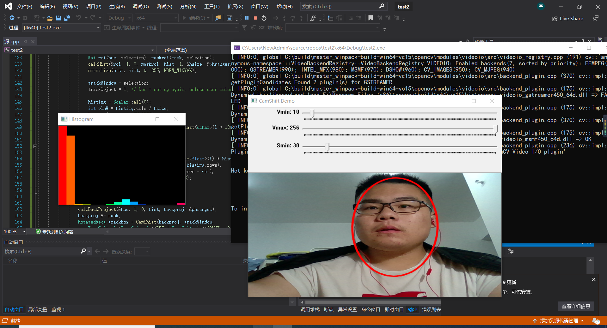
<center>图23 彩色目标跟踪</center>

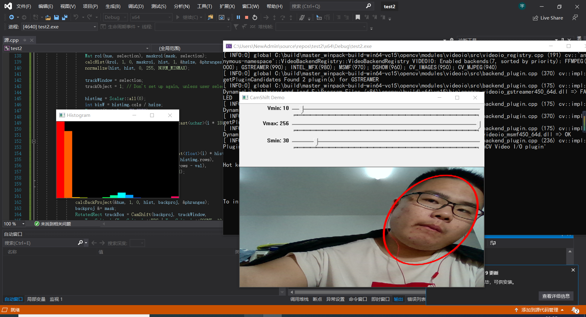
<center>图24 彩色目标跟踪2</center>

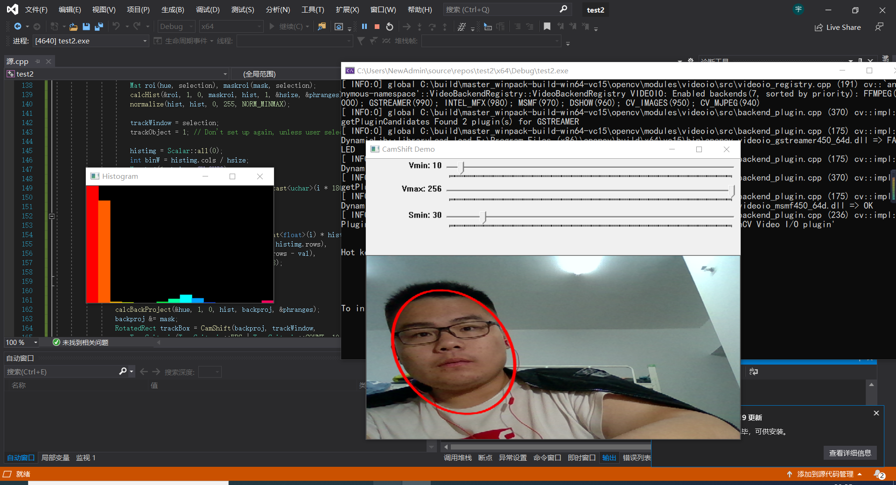
<center>图24 彩色目标跟踪3</center>

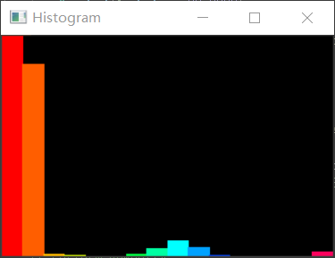
<center>图25 追踪直方图</center>

## 2.2 点追踪---lkdemo

运行opencv\sources\samples\cpp下的lkdemo.cpp文件，会自动调用摄像头，按下r,会启动自动点追踪，可以看到点会随着人像的移动而移动

代码：
```cpp
#include "opencv2/video/tracking.hpp"
#include "opencv2/imgproc.hpp"
#include "opencv2/videoio.hpp"
#include "opencv2/highgui.hpp"

#include <iostream>
#include <ctype.h>

using namespace cv;
using namespace std;

static void help()
{
    // print a welcome message, and the OpenCV version
    cout << "\nThis is a demo of Lukas-Kanade optical flow lkdemo(),\n"
        "Using OpenCV version " << CV_VERSION << endl;
    cout << "\nIt uses camera by default, but you can provide a path to video as an argument.\n";
    cout << "\nHot keys: \n"
        "\tESC - quit the program\n"
        "\tr - auto-initialize tracking\n"
        "\tc - delete all the points\n"
        "\tn - switch the \"night\" mode on/off\n"
        "To add/remove a feature point click it\n" << endl;
}

Point2f point;
bool addRemovePt = false;

static void onMouse(int event, int x, int y, int /*flags*/, void* /*param*/)
{
    if (event == EVENT_LBUTTONDOWN)
    {
        point = Point2f((float)x, (float)y);
        addRemovePt = true;
    }
}

int main(int argc, char** argv)
{
    VideoCapture cap;
    TermCriteria termcrit(TermCriteria::COUNT | TermCriteria::EPS, 20, 0.03);
    Size subPixWinSize(10, 10), winSize(31, 31);

    const int MAX_COUNT = 500;
    bool needToInit = false;
    bool nightMode = false;

    help();
    cv::CommandLineParser parser(argc, argv, "{@input|0|}");
    string input = parser.get<string>("@input");

    if (input.size() == 1 && isdigit(input[0]))
        cap.open(input[0] - '0');
    else
        cap.open(input);

    if (!cap.isOpened())
    {
        cout << "Could not initialize capturing...\n";
        return 0;
    }

    namedWindow("LK Demo", 1);
    setMouseCallback("LK Demo", onMouse, 0);

    Mat gray, prevGray, image, frame;
    vector<Point2f> points[2];

    for (;;)
    {
        cap >> frame;
        if (frame.empty())
            break;

        frame.copyTo(image);
        cvtColor(image, gray, COLOR_BGR2GRAY);

        if (nightMode)
            image = Scalar::all(0);

        if (needToInit)
        {
            // automatic initialization
            goodFeaturesToTrack(gray, points[1], MAX_COUNT, 0.01, 10, Mat(), 3, 3, 0, 0.04);
            cornerSubPix(gray, points[1], subPixWinSize, Size(-1, -1), termcrit);
            addRemovePt = false;
        }
        else if (!points[0].empty())
        {
            vector<uchar> status;
            vector<float> err;
            if (prevGray.empty())
                gray.copyTo(prevGray);
            calcOpticalFlowPyrLK(prevGray, gray, points[0], points[1], status, err, winSize,
                3, termcrit, 0, 0.001);
            size_t i, k;
            for (i = k = 0; i < points[1].size(); i++)
            {
                if (addRemovePt)
                {
                    if (norm(point - points[1][i]) <= 5)
                    {
                        addRemovePt = false;
                        continue;
                    }
                }

                if (!status[i])
                    continue;

                points[1][k++] = points[1][i];
                circle(image, points[1][i], 3, Scalar(0, 255, 0), -1, 8);
            }
            points[1].resize(k);
        }

        if (addRemovePt && points[1].size() < (size_t)MAX_COUNT)
        {
            vector<Point2f> tmp;
            tmp.push_back(point);
            cornerSubPix(gray, tmp, winSize, Size(-1, -1), termcrit);
            points[1].push_back(tmp[0]);
            addRemovePt = false;
        }

        needToInit = false;
        imshow("LK Demo", image);

        char c = (char)waitKey(10);
        if (c == 27)
            break;
        switch (c)
        {
        case 'r':
            needToInit = true;
            break;
        case 'c':
            points[0].clear();
            points[1].clear();
            break;
        case 'n':
            nightMode = !nightMode;
            break;
        }

        std::swap(points[1], points[0]);
        cv::swap(prevGray, gray);
    }

    return 0;
}
```

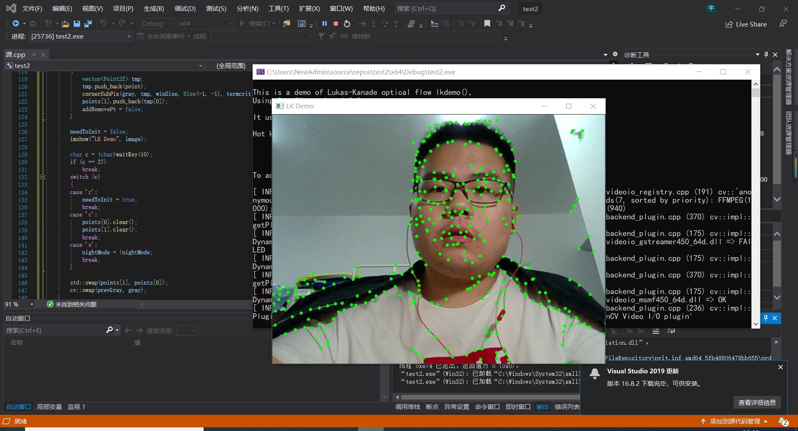
<center>图26 点追踪1</center>

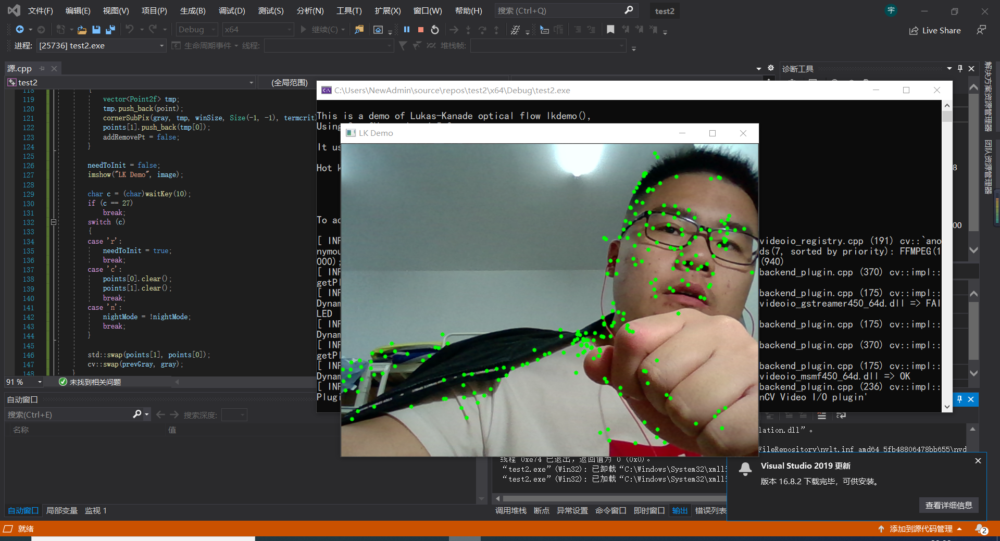
<center>图27 点追踪2</center>

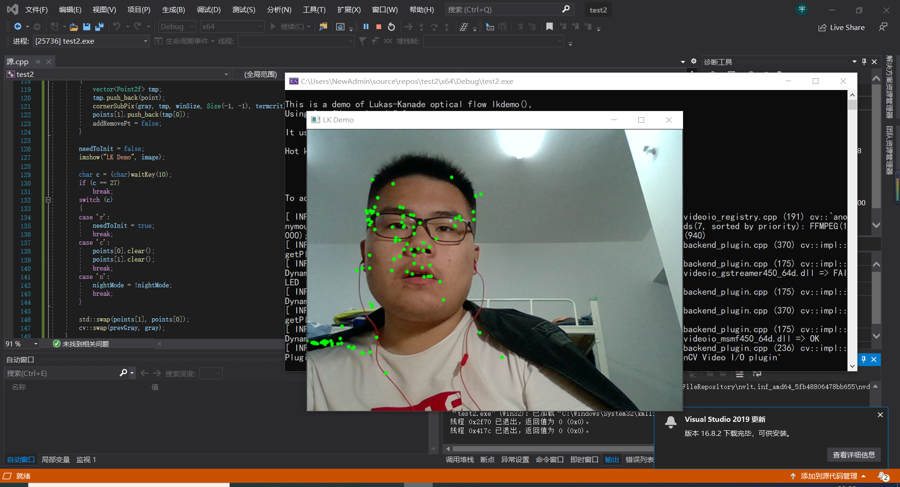
<center>图28 点追踪3</center>

## 2.3 人脸识别

运行"...opencv\sources\samples\cpp\tutorial_code\objectDetection"路径下的objectDetection.cpp文件

需要将"…\opencv\sources\data\haarcascades"路径下的"harcascade_eye_tree_eyeglasses.xml"和"haarcascade frontalface alt.xml"文件复制到和源文件同一目录中，才能正确运行。

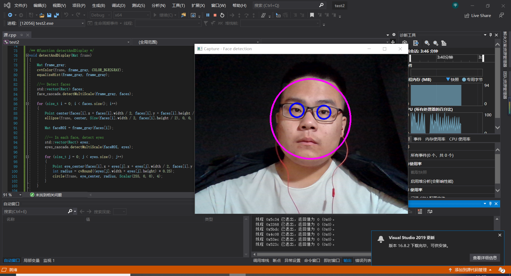
<center>图29 人脸识别</center>

---
# <font color=orange> <center> Summary--2 </center> </font>

- 彩色目标追踪--Camshift
- 点追踪--lkdemo
- 人脸识别--objectDetection

---

# <center> Chapter3  </center>

## 3.1图像的载入、显示和输出

## 3.3 鼠标操作

OpenCV 中的鼠标操作和滑动条的消息映射方式很类似，都是通过一个中介函数配合一个回调函数来实现的。创建和指定滑动条回调函数的函数为createTrackbar，而指定鼠标操作消息回调函数的函数为SetMouseCallback.
SetMouseCallback 函数的作用是为指定的窗口设置鼠标回调函数，原型如下。
```cpp
C++: void setMouseCallback(conststring6winname,MouseCallback onMouse, void* userdata=0 )
```
● 第一个参数，const string&类型的 winname，窗口的名字。
● 第二个参数，MouseCallback 类型的 onMouse，指定窗口里每次鼠标时间发生的时候，被调用的函数指针。这个函数的原型的大概形式为void Foo（int event，intx，inty，itflags，void*param）。其中event 是EVENT_+变量之一，x和y是鼠标指针在图像坐标系（需要注意，不是窗口坐标系）中的坐标值，flags 是 EVENT_FLAG 的组合，param 是用户定义的传递到SetMouseCallback函数调用的参数。如EVENT_MOUSEMOVE为鼠标移动消息、EVENT_LBUTTONDOWN为鼠标左键按下消息等。

```cpp
#include<iostream>
#include <opencv2/opencv.hpp>

using namespace cv;
//为窗口标题定义的宏
#define WINDOW_NAME "【程序窗口】"
void on_MouseHandle(int event, int x, int y, int flags, void* param);
void DrawRectangle(cv::Mat& img, cv::Rect box);
Rect g_rectangle;
bool g_bDrawingBox = false;//是否进行绘制RNG g_rng(12345);
RNG g_rng(12345);
//【1】准备参数
int main(int argc, char** argv) {
	g_rectangle = Rect(-1, -1, 0, 0);
	Mat srcImage(600, 800, CV_8UC3), tempImage;
	srcImage.copyTo(tempImage);
	g_rectangle = Rect(-1, -1, 0, 0);
	srcImage = Scalar::all(0);

	namedWindow(WINDOW_NAME);
	setMouseCallback(WINDOW_NAME, on_MouseHandle, (void*)&srcImage);

	//【3】程序主循环，当进行绘制的标识符为真时，进行绘制
	while (1){
	srcImage.copyTo(tempImage);//复制源图到临时变量
	if (g_bDrawingBox)DrawRectangle(tempImage, g_rectangle);//当进行绘制的标识符为真，则进行绘制
	imshow(WINDOW_NAME, tempImage);
	if(waitKey(10) == 27)
		break;//按下 ESC键，程序退出return 0;
}
return 0;
}
void on_MouseHandle(int event, int x, int y, int flags, void* param) {
	Mat& image = *(cv::Mat*) param;
	switch (event) {
		//鼠标移动消息
	case EVENT_MOUSEMOVE: {
		if(g_bDrawingBox )//如果是否进行绘制的标识符为真，则记录下长和宽到 RECT 型变量中
		{
			g_rectangle.width = x - g_rectangle.x;
			g_rectangle.height = y - g_rectangle.y;
		}
	}
						break;// 左键按下消息
	case EVENT_LBUTTONDOWN:
	{
		g_bDrawingBox = true;
		g_rectangle = Rect(x,y,0,0);//记录起始点)
	}
	break;
	//左键抬起消息
	case EVENT_LBUTTONUP: {
		g_bDrawingBox = false;//置标识符为false //对宽和高小于 0的处理
		if (g_rectangle.width < 0) {
			g_rectangle.x += g_rectangle.width;
			g_rectangle.width *= -1;
		}
		if (g_rectangle.height < 0) {
			g_rectangle.y += g_rectangle.height;
			g_rectangle.height *= -1;
		}
		//调用函数进行绘制
		DrawRectangle(image, g_rectangle);
	}
						break;
	}
}
	
void DrawRectangle(cv::Mat& img, cv::Rect box)
{
	rectangle(img, box.tl(), box.br(), Scalar(g_rng.uniform(0, 255),
		g_rng.uniform(0,255),g_rng.uniform(0,255)));//随机颜色

}
```

效果图：

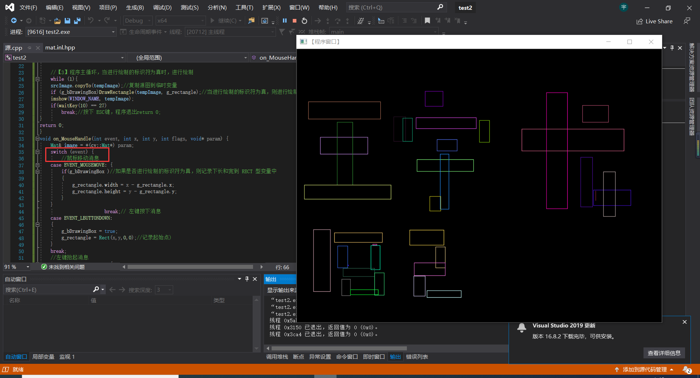
<center>图30 鼠标控制1</center>

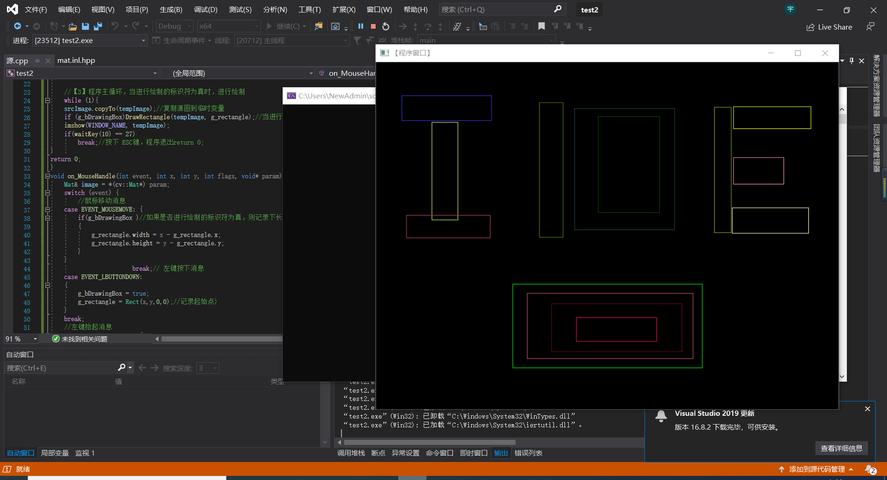
<center>图29 鼠标控制2</center>
